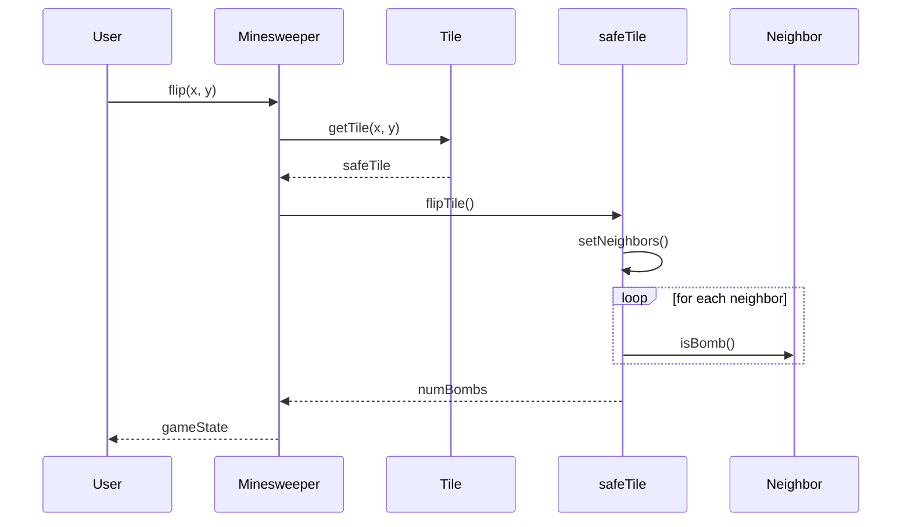
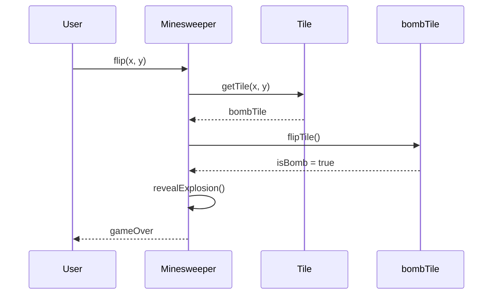
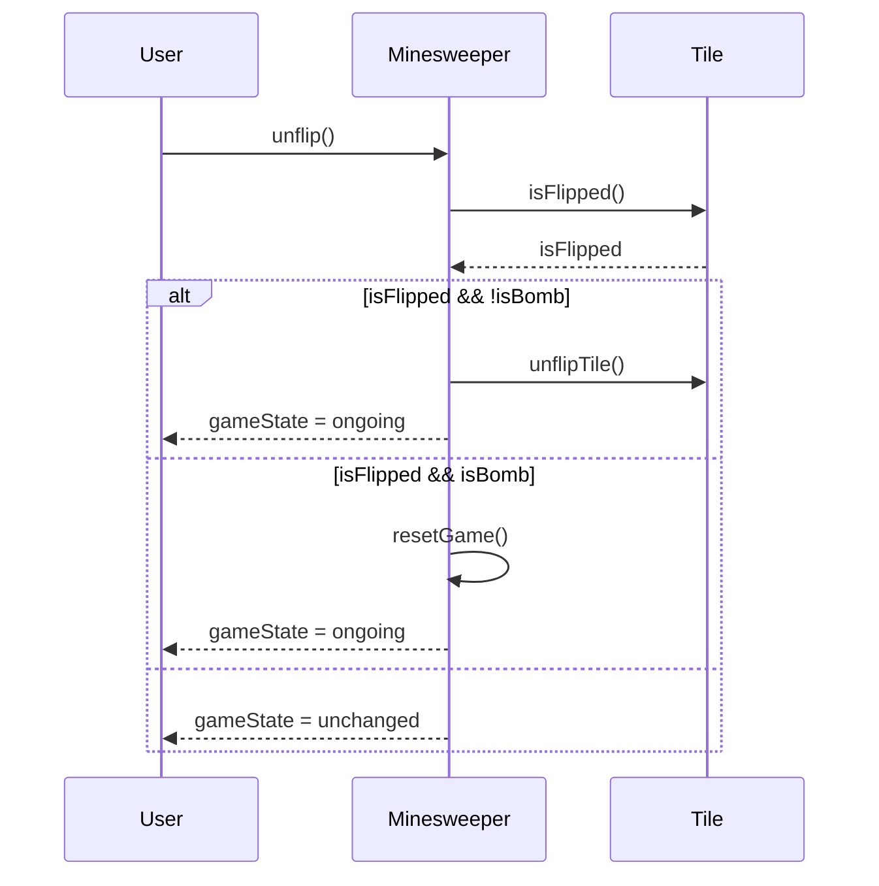

<details>
<summary>Relevant source files</summary>

The following file was used as context for generating this wiki page:

- [Tests.java](https://github.com/aanickode/Minesweeper-Project/blob/main/Tests.java)
</details>

# Testing

The `Tests.java` file contains a suite of JUnit tests for the Minesweeper game implementation. These tests cover various aspects of the game logic, including bomb tiles, safe tiles, game state transitions, and user interactions. The tests serve as a safety net to ensure the correct behavior of the Minesweeper game and its components.

## Bomb Tile Tests

### Bomb Tile Properties

This section tests the properties and behavior of bomb tiles in the Minesweeper game.

```java
@Test
public void testBombTiles() {
    Minesweeper m = new Minesweeper(true);
    Tile bombTile = m.getTile(0, 1);
    assertTrue(bombTile.isBomb());
    assertFalse(bombTile.isFlipped());
    bombTile.flipTile();
    assertTrue(bombTile.isFlipped());
    bombTile.unflipTile();
    assertFalse(bombTile.isFlipped());
    bombTile.setNeighbors();
    assertEquals(-1, bombTile.findNumBombs());
    assertEquals(0, bombTile.getXPos());
    assertEquals(1, bombTile.getYPos());
}
```

The test verifies the following:

1. A bomb tile is correctly identified as a bomb (`assertTrue(bombTile.isBomb())`).
2. Initially, a bomb tile is not flipped (`assertFalse(bombTile.isFlipped())`).
3. After flipping the tile, its state is updated correctly (`assertTrue(bombTile.isFlipped())`).
4. Unflipping the tile reverts its state (`assertFalse(bombTile.isFlipped())`).
5. The `findNumBombs()` method returns -1 for a bomb tile (`assertEquals(-1, bombTile.findNumBombs())`).
6. The `getXPos()` and `getYPos()` methods return the correct coordinates of the bomb tile.

Sources: [Tests.java:5-16]()

## Safe Tile Tests

### Safe Tile Properties and Neighbor Bombs

This section tests the properties and behavior of safe tiles (non-bomb tiles) in the Minesweeper game, including their neighbor relationships with bomb tiles.

```java
@Test
public void testSafeTiles() {
    Minesweeper m = new Minesweeper(true);
    Tile[][] board1 = m.getBoard();
    Tile safeTile = m.getTile(1, 0);
    Tile bombTile1 = board1[0][0];
    Tile bombTile2 = board1[0][1];
    assertFalse(safeTile.isBomb());
    assertFalse(safeTile.isFlipped());
    safeTile.flipTile();
    assertTrue(safeTile.isFlipped());
    safeTile.unflipTile();
    assertFalse(safeTile.isFlipped());
    safeTile.setNeighbors();
    ArrayList<Tile> neighbors = safeTile.getNeighbors();
    neighbors.contains(bombTile1);
    neighbors.contains(bombTile2);
    assertEquals(2, safeTile.findNumBombs());
    assertEquals(1, safeTile.getXPos());
    assertEquals(0, safeTile.getYPos());
}
```

The test verifies the following:

1. A safe tile is correctly identified as not being a bomb (`assertFalse(safeTile.isBomb())`).
2. Initially, a safe tile is not flipped (`assertFalse(safeTile.isFlipped())`).
3. After flipping the tile, its state is updated correctly (`assertTrue(safeTile.isFlipped())`).
4. Unflipping the tile reverts its state (`assertFalse(safeTile.isFlipped())`).
5. The `setNeighbors()` method correctly identifies the neighboring bomb tiles (`neighbors.contains(bombTile1)`, `neighbors.contains(bombTile2)`).
6. The `findNumBombs()` method correctly counts the number of neighboring bomb tiles (`assertEquals(2, safeTile.findNumBombs())`).
7. The `getXPos()` and `getYPos()` methods return the correct coordinates of the safe tile.

Sources: [Tests.java:19-37]()

### Safe Tiles with No Neighboring Bombs

This section tests the behavior of safe tiles that have no neighboring bomb tiles.

```java
@Test
public void testSafeTilesWithNoBombs() {
    Minesweeper m = new Minesweeper(true);
    Tile[][] board1 = m.getBoard();
    Tile safeTile = board1[7][7];
    assertFalse(safeTile.isBomb());
    safeTile.setNeighbors();
    assertEquals(0, safeTile.findNumBombs());
}
```

The test verifies the following:

1. A safe tile is correctly identified as not being a bomb (`assertFalse(safeTile.isBomb())`).
2. The `findNumBombs()` method returns 0 for a safe tile with no neighboring bomb tiles (`assertEquals(0, safeTile.findNumBombs())`).

Sources: [Tests.java:39-45]()

## Game State Tests

### Minesweeper Explosion

This section tests the behavior of the game when a bomb tile is flipped, triggering an explosion.

```java
@Test
public void testMinesweeperExplosion() {
    Minesweeper m = new Minesweeper(true);
    Tile[][] board1 = m.getBoard();
    m.flip(2, 0);
    assertTrue(board1[1][0].isFlipped());
    assertTrue(board1[1][1].isFlipped());
    assertTrue(board1[2][0].isFlipped());
    assertTrue(board1[2][1].isFlipped());
    assertTrue(board1[3][0].isFlipped());
    assertTrue(board1[3][1].isFlipped());
}
```

The test verifies the following:

1. When a bomb tile is flipped (`m.flip(2, 0)`), the surrounding tiles are automatically flipped to reveal the explosion.

Sources: [Tests.java:47-55]()

### Game Over (Loss)

This section tests the behavior of the game when a bomb tile is flipped, resulting in a game over (loss) state.

```java
@Test
public void testMinesweeperGameOverLoss() {
    Minesweeper m = new Minesweeper(true);
    m.flip(0, 0);
    assertEquals(-1,  m.gameResult());
    m.reset();
    assertEquals(0,  m.gameResult());
}
```

The test verifies the following:

1. When a bomb tile is flipped (`m.flip(0, 0)`), the `gameResult()` method returns -1, indicating a game over (loss) state (`assertEquals(-1, m.gameResult())`).
2. After resetting the game (`m.reset()`), the `gameResult()` method returns 0, indicating an ongoing game state (`assertEquals(0, m.gameResult())`).

Sources: [Tests.java:57-62]()

### Game Over (Win)

This section tests the behavior of the game when all safe tiles have been flipped, resulting in a game over (win) state.

```java
@Test
public void testMinesweeperGameOverWin() {
    Minesweeper m = new Minesweeper(true);
    assertEquals(m.getSafeTiles(), 56);
    m.flip(1, 0);
    assertEquals(m.getSafeTiles(), 55);
    assertEquals(0,  m.gameResult());
    for (int i = 1; i < 8; i++) {
        for (int j = 0; j < 8; j++) {
            m.flip(i, j);
        }
    }
    assertEquals(1,  m.gameResult());
    m.reset();
    assertEquals(0,  m.gameResult());
}
```

The test verifies the following:

1. The `getSafeTiles()` method correctly returns the number of safe tiles on the board (`assertEquals(m.getSafeTiles(), 56)`).
2. When a safe tile is flipped (`m.flip(1, 0)`), the number of remaining safe tiles is decremented (`assertEquals(m.getSafeTiles(), 55)`).
3. Initially, the `gameResult()` method returns 0, indicating an ongoing game state (`assertEquals(0, m.gameResult())`).
4. After flipping all safe tiles, the `gameResult()` method returns 1, indicating a game over (win) state (`assertEquals(1, m.gameResult())`).
5. After resetting the game (`m.reset()`), the `gameResult()` method returns 0, indicating an ongoing game state (`assertEquals(0, m.gameResult())`).

Sources: [Tests.java:64-77]()

### Unflipping Tiles

This section tests the behavior of the game when attempting to unflip a tile.

```java
@Test
public void testMinesweeperUnflip() {
    Minesweeper m = new Minesweeper(true);
    Tile[][] board1 = m.getBoard();
    m.flip(1, 0);
    assertEquals(0,  m.gameResult());
    assertTrue(board1[1][0].isFlipped());
    assertFalse(m.unflip());
    assertEquals(0,  m.gameResult());
    m.flip(0, 0);
    assertEquals(-1,  m.gameResult());
    assertTrue(board1[0][0].isFlipped());
    assertTrue(m.unflip());
    assertEquals(0,  m.gameResult());
    assertFalse(board1[0][0].isFlipped());
}
```

The test verifies the following:

1. After flipping a safe tile (`m.flip(1, 0)`), the tile is marked as flipped (`assertTrue(board1[1][0].isFlipped())`), and the game state remains ongoing (`assertEquals(0, m.gameResult())`).
2. Attempting to unflip a safe tile is not allowed (`assertFalse(m.unflip())`), and the game state remains unchanged (`assertEquals(0, m.gameResult())`).
3. After flipping a bomb tile (`m.flip(0, 0)`), the tile is marked as flipped (`assertTrue(board1[0][0].isFlipped())`), and the game state becomes game over (loss) (`assertEquals(-1, m.gameResult())`).
4. Unflipping a bomb tile is allowed (`assertTrue(m.unflip())`), and the game state reverts to an ongoing state (`assertEquals(0, m.gameResult())`).
5. After unflipping the bomb tile, it is marked as not flipped (`assertFalse(board1[0][0].isFlipped())`).

Sources: [Tests.java:79-93]()

## Sequence Diagrams

### Flipping a Safe Tile



This sequence diagram illustrates the flow of interactions when a user flips a safe tile in the Minesweeper game:

1. The user initiates the `flip(x, y)` action on the `Minesweeper` instance.
2. The `Minesweeper` instance retrieves the `Tile` object at the specified coordinates using `getTile(x, y)`.
3. The `Tile` object is returned to the `Minesweeper` instance.
4. The `Minesweeper` instance calls `flipTile()` on the `Tile` object to flip its state.
5. The `Tile` object sets its neighbors by calling `setNeighbors()`.
6. For each neighbor `Tile`, the `isBomb()` method is called to determine if the neighbor is a bomb tile.
7. The `Tile` object calculates the number of neighboring bomb tiles (`numBombs`).
8. The `numBombs` value is returned to the `Minesweeper` instance.
9. The `Minesweeper` instance updates the game state based on the flipped tile and returns it to the user.

Sources: [Tests.java:19-37](), [Tests.java:39-45]()

### Flipping a Bomb Tile



This sequence diagram illustrates the flow of interactions when a user flips a bomb tile in the Minesweeper game:

1. The user initiates the `flip(x, y)` action on the `Minesweeper` instance.
2. The `Minesweeper` instance retrieves the `Tile` object at the specified coordinates using `getTile(x, y)`.
3. The `Tile` object is returned to the `Minesweeper` instance.
4. The `Minesweeper` instance calls `flipTile()` on the `Tile` object to flip its state.
5. The `Tile` object returns `isBomb = true` to the `Minesweeper` instance, indicating that it is a bomb tile.
6. The `Minesweeper` instance calls its internal `revealExplosion()` method to reveal the explosion on the board.
7. The `Minesweeper` instance returns the game over state to the user.

Sources: [Tests.java:5-16](), [Tests.java:47-55](), [Tests.java:57-62]()

### Unflipping a Tile



This sequence diagram illustrates the flow of interactions when a user attempts to unflip a tile in the Minesweeper game:

1. The user initiates the `unflip()` action on the `Minesweeper` instance.
2. The `Minesweeper` instance checks the flipped state of the `Tile` object by calling `isFlipped()`.
3. The `Tile` object returns its flipped state (`isFlipped`) to the `Minesweeper` instance.
4. If the `Tile` is flipped and not a bomb tile (`isFlipped && !isBomb`):
   - The `Minesweeper` instance calls `unflipTile()` on the `Tile` object to unflip its state.
   - The `Minesweeper` instance returns the ongoing game state to the user.
5. If the `Tile` is flipped and is a bomb tile (`isFlipped && i